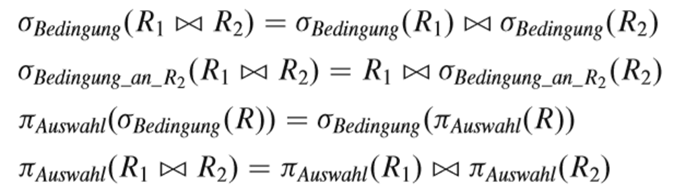
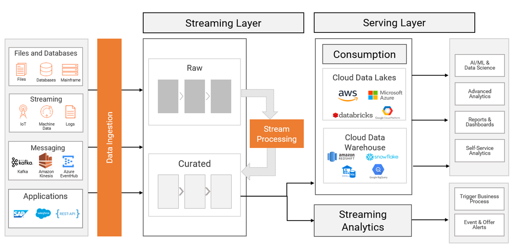
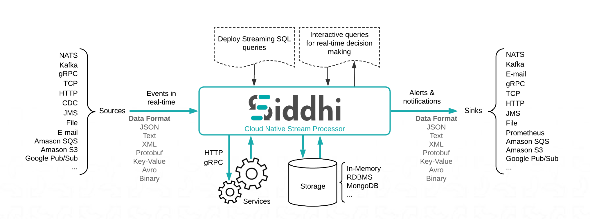

# Aufgabensammlung Datenbanksysteme

Autor: Prof. Dr. Markus Grüne

_Hinweis:_ Die Aufgabensammlung enthält Musterfragen, die in dieser Form auch in der Klausur vorkommen können.  

Datum: 02.06.2025

------------------------
TODO: Lösungen löschen

## Aufgabe 1 - Einleitung

1) Beschreiben Sie, inwieweit sich die Begriffe "Digitalisierung" und "Digitale Transformation" unterscheiden.  
2) Erläutern Sie drei Gründe, wieso Künstliche Intelligenz-Systeme erst in den letzten Jahren aufgekommen sind.  
3) Nennen und beschreiben Sie je einen Vor- und einen Nachteil des Cloud Computings für die Gestaltung von IT-Infrastrukturen in Unternehmen.  
4) Erläutern Sie, für welche Anwendungsfälle relationale Datenbanken geeignet sind und warum diese (nicht oder auf jeden Fall) in den nächsten Jahrzehnten in Unternehmen eingesetzt werden.  

## Aufgabe 2 - Business Intelligence

1) Beschreiben Sie den Unterschied zwischen OLTP und OLAP-Systemen. Gehen Sie insbesondere auf die Einsatzzwecke der beiden Systemtypen ein.  
2) Definieren Sie den Begriff "ROLAP".  
3) Erläutern Sie folgenden Sachverhalt an einem Beispiel:
Measures, die die Anforderung der summarizability erfüllen, müssen Disjunktheit der Instanzen aufweisen.

### Ausfülltext  

Kennzahlen in einem DWH basieren auf **Fakten**-Tabellen.  

Wenn ein OLAP-Würfel wenige Measures enthält, die mit Kombinationen von Dimensionswerten verbunden sind, ist der Würfel **sparse / spärlich** befüllt.  

Eine Dimensionsinstanz umfasst alle **Ausprägungen der Measures** auf allen Ebenen einer Dimension.  

### OLAP-Operationen

Gegeben sei die folgende SQL-Abfrage. Stellen Sie sich vor, dass diese auf einen Würfel ausgeführt wird. Welcher OLAP-Operation würde diese Abfrage entsprechen? Begründen Sie kurz!

```SQL
SELECT
    d.Jahr,
    d.Monat,
    p.Kategorie,
    s.Region,
    SUM(f.Umsatz) AS GesamtUmsatz
FROM
    FaktVerkauf f
JOIN
    DimensionDatum d ON f.DatumID = d.DatumID
JOIN
    DimensionProdukt p ON f.ProduktID = p.ProduktID
JOIN
    DimensionStandort s ON f.StandortID = s.StandortID
WHERE
    d.Jahr = 2024
    AND d.Monat IN ('Januar', 'Februar', 'März') 
    AND p.Kategorie IN ('Elektronik', 'Haushaltsgeräte') 
    AND s.Region IN ('Nord', 'West') 
GROUP BY
    d.Jahr,
    d.Monat,
    p.Kategorie,
    s.Region
ORDER BY
    d.Jahr, d.Monat, p.Kategorie, s.Region;
```

Antwort:  
DICE-Operation
Das Ergebnis der Abfrage wäre ein Teilcube, der Ihnen den aggregierten Umsatz für jede Kombination aus den Monaten Januar, Februar, März 2024, den Produktkategorien Elektronik und Haushaltsgeräte, und den Regionen Nord und West anzeigt. Sie erhalten präzise Einblicke in dieses spezifische "Würfelstück" Ihrer Daten.  

## Aufgabe 3 - Optimierung von DBn und Verteilung

### Wahr oder falsch?

|  Beispiel | Wahr | Falsch |
| -- | -- | -- |
| Ein Query Execution Plan kann verwendet werden, um zu prüfen, ob durch das Setzen eines Indexes die Performance einer Abfrage erhöht werden kann | x | |
| Bei einer Menge von vorher bekannten Werten, die ein Attribut aufnehmen kann, ist es aus Performance-Gründen sinnvoll, einen ENUM-Datentyp zu definieren. | x | |
| Abfragen, die auf Ungleichheit prüfen (!=) sind deutlich schneller als Abfragen, die auf Gleichheit prüfen. | | x |
| Spalten, die in Selektionskriterien verwendet werden, sollten i.d.R. indiziert werden, wenn die Performance nicht ausreicht. | x | |

### Optimierung

In der folgenden Abbildung finden Sie 4 Optimierungsregeln. Schildern Sie, in welchem Fall die 4. Regeln angewendet werden kann.  


### Trigger

```SQL
CREATE TRIGGER before_update_salary BEFORE UPDATE ON employees 
FOR EACH ROW 
BEGIN 
IF NEW.salary <> OLD.salary THEN 
    INSERT INTO salary_changes(employee_id,old_salary,new_salary) 
    VALUES(NEW.employee_id,OLD.salary,NEW.salary); 
END IF; 
END;
```

Erklären Sie, welche Funktion dieser Trigger hat und was unter `NEW` und `OLD` zu verstehen ist.  

### Stored Procedure

Erstellen Sie eine Stored Procedure namens `berechneSumme`, die folgende Aufgabe ausführt:

* Es soll eine Rechnungssumme ermittelt werden.  
* Die Rechnungssumme wird aus den Preisen in der Tabelle `Rechnungsposition` ermittelt.  
* Rechnungspositionen umfassen die Rechnungsnummer (`Rg.ID`) sowie die fortlaufenden Positionsnummern.  
* Preise der Positionen errechnen sich aus der `Menge` in der Tabelle Position und dem `Einzelpreis`, der ebenfalls in der Tabelle Position gespeichert ist.  

Tabelle: _Rechnung_

| Rg.ID | Datum | Besteller |
| -- | -- | -- |
| R-1 | 13.10.2024 | A-Firma |
| R-2 | 14.10.2024 | B-Firma |

Tabelle: _Rechnungsposition_

| Rg.ID | Pos.ID | Artikel | Menge | Einzelpreis |
| -- | -- | -- | -- | -- |
| R-1 | P-1 | Schnappverschluss | 2 | 4.50 |
| R-1 | P-2 | Staubwedel | 1 | 12.90 |
| R-2 | P-1 | Schnürsenkel | 2 | 3.00 |
| R-2 | P-2 | Schuhcrème | 3 | 4.75 |

## Aufgabe 4 - NoSQL

### Dokumentorientierte Datenbanken

1) Was verstehen Sie unter einem Dokument im Sinne einer dokumentorientierten DB? Inwieweit unterscheidet sich dies von einem herkömmlichen Dokument, z.B. einem Word-Dokument?  
2) Das CAP-Theorem besagt, dass nur zwei der folgenden Eigenschaften durch eine Datenspeicherlösung umgesetzt werden können: Consistency, Availability, Partition Tolerance. Erläutern Sie die drei Eigenschaften.  

## Aufgabe 5 - Datenformate

1) Erklären Sie, wozu XML aus geschäftlicher Sicht verwendet werden kann.  
2) XML-Dokumente können nach dem Parsen in einem DOM vorliegen. Was ist damit gemeint und wozu kann das DOM verwendet werden?

### YAML nach JSON - Transformationsaufgabe

Forme das folgende YAML-Dokument in ein JSON-Dokument um:

```YAML
person:
  name:
    vorname: Lang
    nachname: Lang
  geburtsdatum: 1982-06-14
  geburtsort: Shenyang, China
  nationalitaet: Chinesisch
  webseite: https://www.langlang.com

musikalische_informationen:
  instrumente:
    - Klavier
  ausbildung:
    - institution: Zentrales Musikkonservatorium Peking
      ort: Peking, China
      abschlussjahr: null # Jahr ist nicht explizit genannt
    - institution: Curtis Institute of Music
      ort: Philadelphia, USA
      abschlussjahr: 2008 # Beispielhaftes Abschlussjahr
```

```JSON
{
  "person": {
    "name": {
      "vorname": "Lang",
      "nachname": "Lang"
    },
    "geburtsdatum": "1982-06-14",
    "geburtsort": "Shenyang, China",
    "nationalitaet": "Chinesisch",
    "webseite": "https://www.langlang.com"
  },
  "musikalische_informationen": {
    "instrumente": [
      "Klavier"
    ],
    "ausbildung": [
      {
        "institution": "Zentrales Musikkonservatorium Peking",
        "ort": "Peking, China",
        "abschlussjahr": null
      },
      {
        "institution": "Curtis Institute of Music",
        "ort": "Philadelphia, USA",
        "abschlussjahr": 2008
      }
    ]
  }
}
```

## Aufgabe 6 - MongoDB

Vorbereitung: Erstellen Sie sich eine MongoDB-Datenbank mit dem Namen `Aufgabe_6`. In der DB erstellen Sie zwei Collections mit den Namen 'studierende' und 'referenten'.

Laden Sie die beiden Dateien in die Collections:
[studierende.json](studierende.json) und [referenten.json](referenten.json)  

1) Wieviele Dokumente befinden sich nun in den Collections?
2) Was macht die folgende Abfrage:

```JSON
--- Abfrage 1

db.referenten.insertOne(
  {
    "anrede": "Frau",
    "titel": "Dr.",
    "vorname": "Lena",
    "nachname": "Müller",
    "telefon": "+49 30 99887766",
    "email": "lena.mueller@intern.de",
    "adresse": "Hauptstr. 5, 10115 Berlin",
    "strasse": "Hauptstr.",
    "plz": "10115",
    "ort": "Berlin",
    "hausNr": "5",
    "idReferent": 29, // Beispiel für eine neue, eindeutige ID
    "istExtern": 0,   // 0 für intern
    "adrHinweis": ""
  }
);

--- Abfrage 2
db.referenten.updateOne(
  { "idReferent": 1 }, 
  { $set: { "mittelname": "Kemal" } } 
);

```

## Aufgabe 7 - Graphen(datenbanken)

1) Zeichnen Sie einen ungerichteten Graphen mit 4 Knoten und 5 Kanten.  
2) Beschreiben Sie einen Anwendungsfall, für den Graphendatenbanken wie Neo4J besser geeignet sind als relationale Datenbanken.  
3) Erstellen Sie eine Neo4J-Datenbank mit folgender Spezifikation  

* Es sollen die Schulfächer Mathematik, Englisch und Deutsch erfasst werden.  
* Es sollen vier Schüler erfasst werden, die die Fächer belegen. Nicht alle sollen dieselben Fächerkombinationen belegen. Die Schüler haben einen Vornamen und einen Nachnamen sowie ein Alter in Jahren.  
* Ein Schüler bzw. eine Schülerin schreibt eine Klausur in Mathematik am 4.6.2025. Ein/e weitere/r schreibt am 7.6.2025 eine Klausur in Englisch.  

* Dumpen Sie die Datenbank und laden Sie diese auf den Stick. Der Name des Dumps muss Ihrem Nachnamen entsprechen.  

4) Ermitteln Sie mit jeweils einer Abfrage  

* alle Schüler, die Klausuren schreiben.
* alle Schüler, die das Fach Englisch belegt haben.  
* alle Schüler, die zwischen 16 und 18 Jahren alt sind.  

## Aufgabe 8 - verteilte Datenverarbeitung


Quelle: <https://www.informatica.com/blogs/adopt-a-kappa-architecture-for-streaming-and-ingesting-data.html>

1) Beschreiben Sie die Aufgaben des Streaming Layers in der Kappa-Architektur anhand der obigen Grafik.
2) Inwieweit unterscheidet sich die Kappa-Architektur von der Lambda-Architektur?

3) Die Firma Siddhi vertreibt ein System, das in folgender Abbildung architektonisch sehr abstrakt dargestellt ist.  



Beschreiben Sie anhand der Vorlesung, um welche Art von System es sich hier handeln könnte.  

## Aufgabe 9 - Apache Hadoop

./.

## Aufgabe 10 - Datenintegration

1) Beschreiben Sie, inwieweit Distribution, Autonomie und Heterogenität Herausforderungen für die Integration von separate vorliegenden Datenbeständen stellen können. 
2) Nennen Sie Integrationsprobleme auf der technischen Ebene, denen Sie z.B. während der Integrationsaufgabe im Kurs begegnen mussten.  
3) Geben Sie ein Beispiel für Schema-Heterogenität.  
