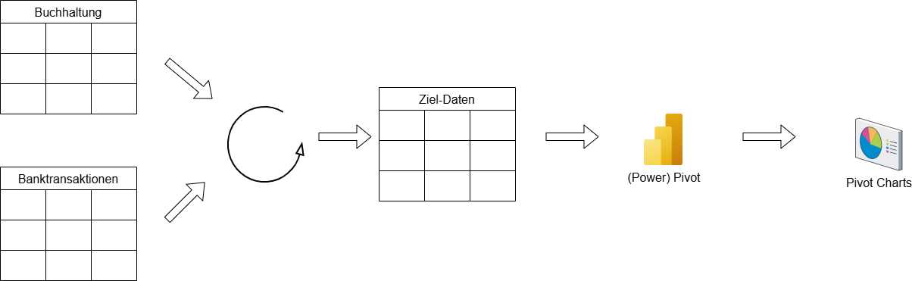

# ETL mit Excel - Steuerliche Datenanalyse für Kleinunternehmen

## Einleitung / Szenario

Herr Paul Meier ist ein selbstständiger IT-Berater und Kleinunternehmer. Für das erste Quartal des Geschäftsjahres 2024 (Januar bis März) hat er seine Geschäftsausgaben in einer einfachen Buchhaltungssoftware erfasst. Nun möchte er seinen Jahresabschluss vorbereiten und die erfassten Ausgaben mit seinen Banktransaktionen abgleichen, um sicherzustellen, dass alle relevanten Ausgaben korrekt erfasst und keine möglichen Abzüge vergessen wurden. Außerdem möchte er einen Überblick über seine Einnahmen und Ausgaben pro Kategorie und Monat erhalten.

Die Daten aus der Buchhaltungssoftware liegen als CSV-Export vor und enthalten nur Ausgaben. Die Banktransaktionen liegen als Excel-Export vor und enthalten sowohl Abbuchungen (Ausgaben) als auch Gutschriften (Einnahmen). Die Kategorisierung in der Buchhaltungssoftware und die Beschreibungen in den Banktransaktionen sind nicht immer identisch, und es gibt Transaktionen in der Bank, die nicht in der Buchhaltung erfasst wurden (und umgekehrt).

### Lernziele

Nach Bearbeitung dieser Fallstudie können Sie:

* Daten aus verschiedenen Quellen (CSV, Excel) in Excel Power Query laden.
* einfache Datenbereinigungs- und Transformationsschritte in Power Query ausführen (Datentypen anpassen, Spalten umbenennen, neue Spalten berechnen, bedingte Logik anwenden).
* Daten basierend auf Textinhalten kategorisieren.
* Daten aus unterschiedlichen Quellen konsolidieren.
* Pivot-Tabellen und Pivot-Charts zur Analyse von Finanzdaten erstellen.
* Diskrepanzen zwischen verschiedenen Datenquellen identifizieren

### Daten

1) [Bank-Transaktionen](bank_transaktionen_q1_2024.xlsx)  
2) [Export aus Buchhaltungssoftware](buchhaltung_ausgaben_q1_2024.csv)

### Literatur / Quellen

* Eine Einführung in die Sprache M Transformation Language, die zur Datentransformation in Power Query verwendet wird, finden Sie unter: <https://learn.microsoft.com/en-us/powerquery-m/m-spec-introduction>

## Aufgabe 1: Voranalyse (45 Minuten)

Bevor wir mit der Fallstudie starten, müssen wir ein Verständnis der Eingangs- und Zieldaten entwickeln. Dabei versuchen wir, kontrolliert vorzugehen und unsere Entscheidungen für die Art, wie wir unseren ETL-Prozess gestalten, transparent darzustellen.  

### Analyse der Eingangs-Dateien

Hintergrund: Im Unternehmen wird die Buchführung lediglich in Form einer Ein-Ausgaben-Rechnung durchgeführt. Wir sehen also in der Fallstudie keine "doppelte Buchführung mit Soll- und Haben-Seite", sondern nur Einnahmen oder Ausgaben in den Excel-Dumps. Das Ziel ist es, wie in der Abbildung dargestellt, die Eingangs-Daten in ein Zielformat zu überführen. Dieses dient dann dazu, Pivot-Tabellen und Pivot Charts für Analysezwecke zu erzeugen.  

Aus technischer Sicht ist es wichtig, dass aus der Zieldatei hervorgeht, aus welcher Quelle die Daten stammen.  

Schauen Sie sich die folgenden beiden Excel-Dateien an.  

* [Bank-Transaktionen als Excel](./bank_transaktionen_q1_2024.xlsx)
* [Transaktionen aus der Buchhaltung als Excel](.Ebuchhaltung_ausgaben_q1_2024.csv)

#### Fragenblock 1

* Worin unterscheiden sich die beiden Excel-Dateien? Notieren Sie sich die Unterschiede.  
* Welche Spalten fehlen dazu in den Dateien?  
* Gibt es Auffälligkeiten in den Datenformaten (z.B. negative und positive Werte, Feldlängen etc.)  
* Gibt es Werte, die überhaupt so nicht verarbeitet werden können?

> Hinweis: Wir wollen später eine Pivot-Tabelle aus den beiden Dateien erzeugen, um damit eine Datenanalyse durchzuführen. Um die Analyse in einer Tabelle zu ermöglichen, ist es sinnvoll, die Daten in eine Datei zu migrieren.  

#### Aufgabenblock 1  

* Erstellen Sie nach Ihrer Voranalyse **Datenkataloge für die beiden Eingangs-Dateien**.  
* Erstellen Sie einen weiteren **Datenkatalog für das Zielformat**, auf dem die Pivot-Tabelle aufbauen soll. Beschreiben Sie in diesem Datenkatalog auch, wie die Werte in der Zieldatei entstehen (um später die Data Provenance zu gewährleisten).
