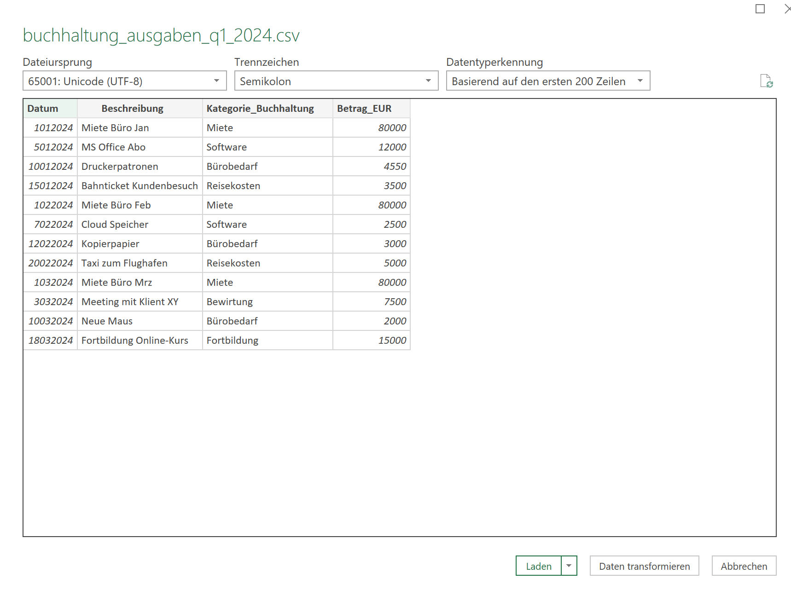
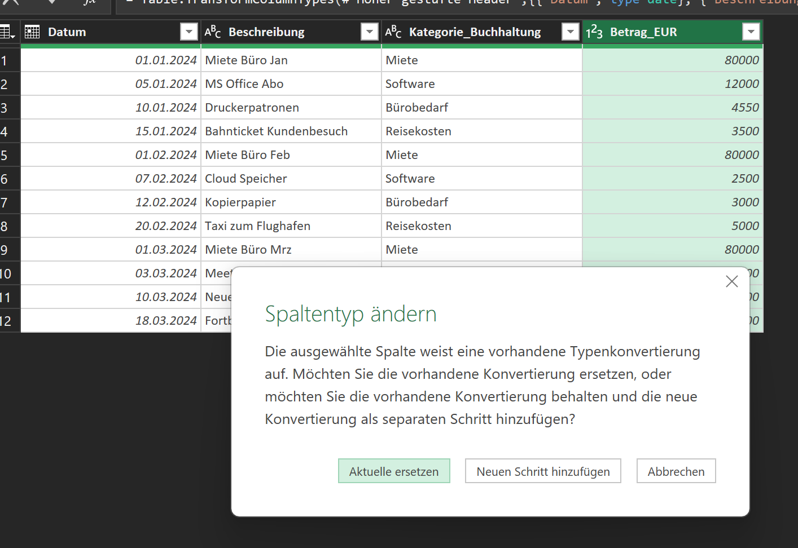
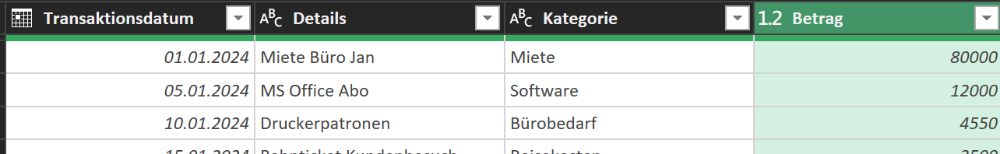
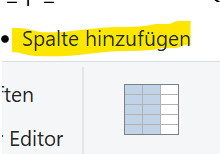
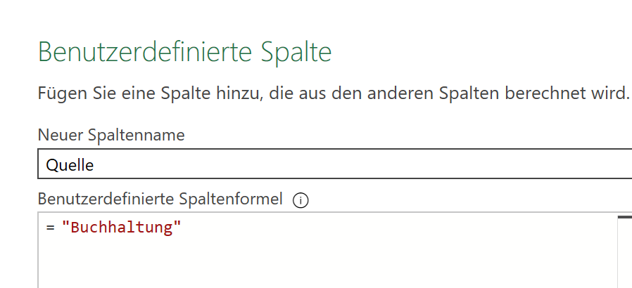
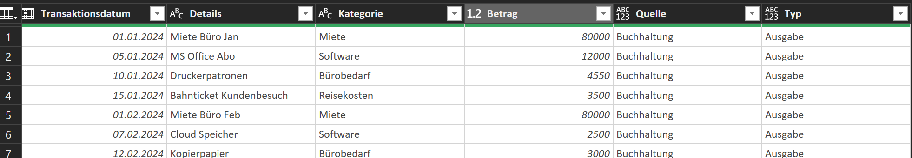
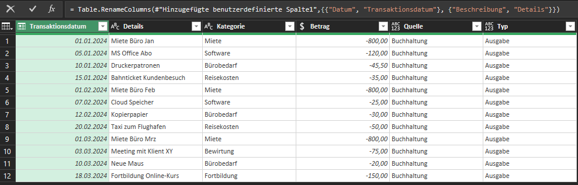
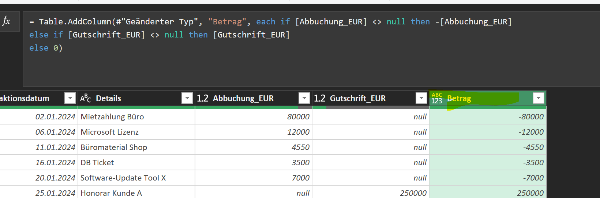

# Fallstudie: Steuerliche Datenanalyse für Kleinunternehmer

Ergebnisse aus Aufgabe 1

* Wir sind mit den Daten vertraut und haben ein Ziel-Schema entwickelt.  

## Daten extrahieren, transformieren und laden mit Power Query

Da Excel ein Teil des Power Apps-Kosmos ist, können bei der Arbeit mit Excel eine Vielzahl von Sprachen verwendet werden.  Eine gute Übersicht über verfügbare Sprachen und deren  Einsatzzwecke können Sie unter folgendem Link finden:
[Sprachen im Power Apps-Kosmos][powerAppsSprachen]

Bei der Extraktion kommt die Sprache "M" zum Einsatz.

## Aufgabe 2: Daten extrahieren (30 Minuten)

***Hinweis***: Bitte passen Sie die folgenden Schritte an die Lösungsstrategie aus Aufgabe 1 an. Wenn Sie z.B. andere Spaltenübrschriften oder Datenformate gewählt haben, ändern Sie die Anfrage im Folgenden entsprechend ab.  

### Vorbereitung: Excel-Datei für den Load erzeugen und Power Query Editor starten  

* Erstellen Sie eine Excel-Datei mit dem Namen `Übung_ETL.xlsx`
* Öffnen Sie ein leeres Excel-Arbeitsblatt in dieser Datei.

### Aufgabe 2.1: Laden und Transformieren der buchhaltung_ausgaben_q1_2024.csv

* Gehen Sie zu `Daten > Daten abrufen > Aus Datei > Aus Excel-Arbeitsmappe` (für die folgende Excel-Datei) bzw. `Aus Text/CSV` (für die CSV-Datei).  
* Klicken Sie  auf `Daten transformieren`. Sie sollten nun folgendes Fenster in Excel sehen:



* Datentypen anpassen: Stellen Sie sicher, dass vor dem Laden das `Datum` als Datum und `Betrag_EUR` als Währung erkannt werden. Klicken Sie oben links auf den Datentyp und ändern Sie diesen. Bestätigen Sie mit `Aktuelle ersetzen`



* Spalten umbenennen: Benennen Sie zur Konsistenzsicherung die Spalten um:
  * Datum -> Transaktionsdatum
  * Beschreibung -> Details
  * Kategorie_Buchhaltung -> Kategorie
  * Betrag_EUR -> Betrag



* Neue Spalte 'Quelle' hinzufügen: Fügen Sie eine benutzerdefinierte Spalte namens Quelle hinzu, die den Wert "Buchhaltung" enthält.  
  

> Hinweis: In dieser Form können Sie die Datenquelle später nachvollziehen. In einem betrieblichen Szenario wären auch noch andere Parameter relevant, z.B. der Dateiname des Loads.

* Erstellen Sie analog zum vorherigen Schritt eine neue Spalte 'Typ'. Diese soll den Wert "Ausgabe" enthalten (da diese Datei nur Ausgaben enthält).
* Das Ergebnis sollte nun so aussehen:

* Der **Betrag muss noch korrigiert werden**; er ist um den Faktor 100 zu groß. Ausgaben sollen negative Werte sein, Einnahmen positive. Entsprechend müssen wir die Ausgaben der Buchhaltung durch 100 teilen und mit minus 1 multiplizieren:  > Transformieren > Standard > Multiplizieren (mit -(0.01)) oder / Teilen (durch -100)  

* Ergebnis:


Klicken Sie nun im Power Query-Editor auf `Schließen und Laden`.  

### Aufgabe 2.2: Laden und Transformieren der bank_transaktionen_q1_2024.xlsx

* Laden Sie die Excel-Datei.
* Datentypen anpassen: Stellen Sie sicher, dass `Transaktionsdatum` als `Datum` und `Abbuchung_EUR` sowie `Gutschrift_EUR` als Währung erkannt werden.
* 'Betrag'-Spalte erstellen: Fügen Sie eine benutzerdefinierte Spalte namens `Betrag` hinzu, die die Werte aus `Abbuchung_EUR` und Gutschrift_EUR kombiniert:
  * Wenn `Abbuchung_EUR` einen Wert hat, soll der Betrag `-Abbuchung_EUR` sein (negativ für Ausgaben).
  * Wenn `Gutschrift_EUR` einen Wert hat, soll der Betrag `Gutschrift_EUR` sein (positiv für Einnahmen).

```M
if [Abbuchung_EUR] <> null then -[Abbuchung_EUR]
else if [Gutschrift_EUR] <> null then [Gutschrift_EUR]
else 0)
```



* Neue Spalte 'Quelle' hinzufügen: Fügen Sie eine benutzerdefinierte Spalte namens Quelle hinzu, die den Wert "Bank" enthält.
* Neue Spalte 'Typ' hinzufügen: Fügen Sie eine benutzerdefinierte Spalte namens Typ hinzu:
  * Wenn `Abbuchung_EUR` einen Wert hat, soll der Typ "Ausgabe" sein.
  * Wenn `Gutschrift_EUR` einen Wert hat, soll der Typ "Einnahme" sein.

```M
if [Abbuchung_EUR] <> null then "Ausgabe" 
else if [Gutschrift_EUR] <> null then "Einnahme" 
else "ungültig"
```

* Neue Spalte 'Kategorie' hinzufügen (Herausforderung!): Fügen Sie eine benutzerdefinierte Spalte namens Kategorie hinzu. Diese soll die Transaktionen basierend auf dem `Details`-Text einer Kategorie zuordnen. Wenn keine Kategorie erkannt wird, verwenden Sie "Sonstiges".

```M
if Text.Contains([Details], "Mietzahlung")            then "Miete"
else if  Text.Contains([Details], "Microsoft") 
      or Text.Contains([Details], "Cloud") 
      or Text.Contains([Details], "Software")         then "Software"
else if  Text.Contains([Details], "Büromaterial") 
      or Text.Contains([Details], "Papier") 
      or Text.Contains([Details], "Elektrofachmarkt") then "Bürobedarf"
else if  Text.Contains([Details], "DB Ticket") 
      or Text.Contains([Details], "Taxi") 
      or Text.Contains([Details], "Parkgebühren")     then "Reisekosten"
else if  Text.Contains([Details], "Restaurant")       then "Bewirtung"
else if  Text.Contains([Details], "Online Kurs")      then "Fortbildung"
else if  Text.Contains([Details], "Honorar Kunde")    then "Einnahmen"
else                                                        "Sonstiges"
```

**Achtung: Prüfen Sie die Ergebnisse. Es kann sein, dass wir falsche Zuordnungen erhalten!!!**

* Unnötige Spalten entfernen: Entfernen Sie die Spalten `Abbuchung_EUR` und `Gutschrift_EUR`.

## Aufgabe 3: Daten konsolidieren (10 Minuten)

### Aufgabe 3.1: Daten zusammenführen

* Benennen Sie die Abfrage `buchhaltung_ausgaben_q1_2024` um in `Buchhaltung`
* Verwenden Sie Abfragen anfügen (Append Queries) im Power Query Editor.
* Fügen Sie die transformierte Bank-Transaktionen-Tabelle an die transformierte Buchhaltungs-Ausgaben-Tabelle an. Nennen Sie die neue Abfrage `Konsolidierung`. Verwenden Sie dazu "Abfragen als neu anfügen".  

Ergebnis:  


* Stellen Sie auch hier wieder sicher, dass Transaktionsdatum und Betrag korrekt formatiert sind (Datum bzw. Währung).
* Gruppieren Sie zuletzt die drei Abfragen in die Gruppe `Buchungssätze`. Gruppierungen sind hilfreich, um bei komplexeren Datenbereinigungen den Überblick über einzelne Schritte zu behalten.

### Aufgabe 3.1: Laden der Daten und Verbindung erstellen

* Klicken Sie auf Schließen & laden > Schließen & laden in... > Nur Verbindung erstellen.  

> Dies ist besser, da die Daten direkt in das Datenmodell geladen werden und nicht erneut in Excel. Der Nachteil ist jedoch, das Sie die Daten nicht in der Standard-Excel-Ansicht der Tabellen sehen.  

* Rechtsklicken Sie im Abfragebereich auf `Konsolidierung` und wählen Sie Laden in... > Nur Verbindung erstellen. Dies lädt die Daten ins Power Pivot Datenmodell.  

## Aufgabe 4: Report erstellen mit Pivot-Charts

Verwenden Sie die geladene `Konsolidierung` , um die folgenden Pivot-Charts zu erstellen:

### Aufgabe 4.1: Report erstellen - Monatliche Entwicklung der Einnahmen und Ausgaben nach Quelle

#### Pivottabelle erstellen  

* Erstellen Sie eine Pivot-Tabelle basierend auf `Konsolidierung`. Verwenden Sie dazu "Empfohlene PivotTabellen"
* Ziehen Sie Transaktionsdatum in die Zeilen und gruppieren Sie es nach Jahren und Monaten.
* Ziehen Sie Quelle in die Spalten.
* Ziehen Sie Betrag in die Werte (Summe).
* Fügen Sie einen Slicer für Typ hinzu (filterbar auf "Einnahme" oder "Ausgabe").
  * Schritt-für-Schritt-Anleitung:
    * Wählen Sie eine Zelle innerhalb Ihrer Pivot-Tabelle aus.
    * Das ist wichtig, da die Registerkarten "PivotTable-Analyse" (oder "PivotTable-Tools") und "Einfügen" nur dann sichtbar werden.
    * Gehen Sie zur Registerkarte "PivotTable-Analyse" (oder "Analysieren" bei älteren Excel-Versionen) im Menüband.
    * Klicken Sie in der Gruppe "Filtern" auf "Datenschnitt einfügen" (oder "Slicer einfügen").

#### Säulendiagrmm erstellen  

* Erstellen Sie ein Gruppiertes Säulendiagramm (oder Liniendiagramm), das die monatlichen Einnahmen/Ausgaben pro Quelle (Bank vs. Buchhaltung) visualisiert.

### Aufgabe 4.2: Report zum Vergleich der Ausgabenkategorien nach Quelle

#### Pivottabelle erstellen (2)  

* Erstellen Sie eine neue Pivot-Tabelle.
* Ziehen Sie Kategorie in die Zeilen.
* Ziehen Sie Quelle in die Spalten.
* Ziehen Sie Betrag in die Werte (Summe). Stellen Sie sicher, dass es nur Ausgaben sind (Slicer Typ auf "Ausgabe" setzen).

#### Säulendiagrmm erstellen (2)  

* Erstellen Sie ein Gruppiertes Säulendiagramm oder ein Balkendiagramm, um die Ausgaben pro Kategorie aus der Buchhaltung und von der Bank gegenüberzustellen.

### Aufgabe 4.3: Report Top-Ausgabenkategorien gesamt  

* Erstellen Sie eine neue Pivot-Tabelle.
* Ziehen Sie Kategorie in die Zeilen.
* Ziehen Sie Betrag in die Werte (Summe). Stellen Sie sicher, dass es nur Ausgaben sind (Slicer Typ auf "Ausgabe" setzen).
Wenden Sie einen Wertfilter auf Kategorie an, um z.B. die Top 5 oder Top 10 Kategorien anzuzeigen.
* Erstellen Sie ein Säulendiagramm oder Balkendiagramm.

## Aufgabe 5: Fragen zur Analyse und Reflexion

Nachdem Sie die Pivot-Tabellen und -Charts erstellt haben, beantworten Sie folgende Fragen:

* Identifizieren Sie Transaktionen, die in den Bankdaten auftauchen, aber nicht in den Buchhaltungsdaten oder umgekehrt.  
* Gibt es Kategorien, bei denen die Ausgaben zwischen Buchhaltung und Bank voneinander abweichen? Welche Gründe könnten hierfür vorliegen?
* Betrachten Sie die Kategorie-Spalte, die Sie in Power Query erstellt haben. Wie robust ist Ihre Kategorisierungslogik? Welche Herausforderungen gab es bei der Zuordnung von Banktransaktionen zu Kategorien, und wie könnten Sie diese verbessern?
* Welchen Vorteil bietet die Konsolidierung von Daten aus verschiedenen Quellen für die Erstellung eines Jahresabschlusses und die Steuererklärung?

[powerAppsSprachen]: https://community.fabric.microsoft.com/t5/Power-BI-Community-Blog/The-Languages-of-Power-BI/ba-p/69104
