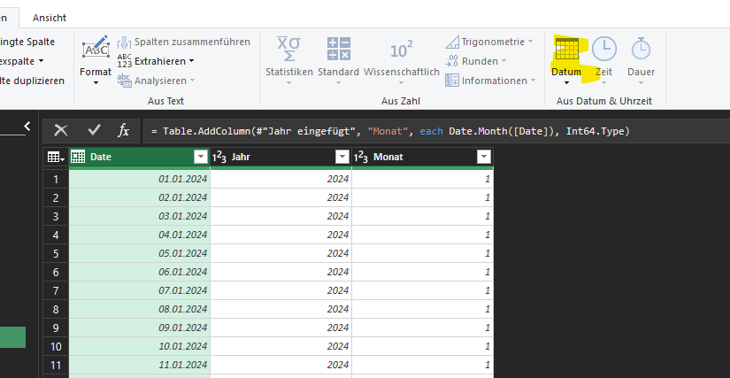

# Erstellen einer Datumsdimensionstabelle in Power Query aus Einnahmen und Kosten

## Voraussetzungen  

Sie haben die folgende Datei heruntergeladen:  
[Zusammengeführte Daten](Zusammengeführte_Daten.xlsx)

Kopieren Sie diese und benennen Sie die Datei um nach:  
`Schritt2_Dimensionstabelle_für_Datum_anlegen.xlsx`

## Hintergrund

Eine Datumsdimensionstabelle (Date Dimension Table) ist ein Eckpfeiler der meisten Datenmodelle. 

* Sie bietet eine einzige, umfassende Quelle für datumsbezogene Attribute (wie Jahr, Monatsname, Wochentag, Quartal), mit denen Sie Ihre Daten aus verschiedenen Faktentabellen (wie Einnahmen und Kosten) konsistent auswerten können.

Warum eine Datumsdimension erstellen?

* Einheitliche Datumsquelle: Alle Ihre Faktentabellen (Umsätze, Kosten usw.) können mit einer einzigen Datumstabelle verknüpft werden, wodurch eine konsistente datumsbasierte Analyse über alle Kennzahlen hinweg gewährleistet ist.
* Erweiterte Attribute: Sie können verschiedene Zeitintelligenzattribute (z. B. Jahr, Monatsname, Quartal, Wochentag) hinzufügen, die in Ihren rohen Transaktionstabellen normalerweise nicht vorhanden sind.
* Leistung: Durch geeignete Datumsdimensionen können Sie die Leistung Ihres Datenmodells verbessern, insbesondere in Verbindung mit Zeitintelligenzfunktionen.
* Kalendersteuerung: Sie haben die volle Kontrolle über Ihren Kalender, einschließlich Geschäftsjahren, benutzerdefinierten Zeiträumen oder Feiertagsmarkierungen.

Voraussetzungen

* Sie haben entweder eine Tabelle, in der die Buchungen vorliegen oder zwei Tabellen, z.B. "Revenues" und "Costs", in Excel geladen (oder als Verbindungen) und können mit Power Query darauf zugreifen.
* Sowohl die Tabelle "Revenues” als auch die Tabelle "Costs” müssen mindestens eine Spalte mit Datumsangaben enthalten (z. B. "RevenueDate” in "Revenues” und "CostDate” in "Costs”).

## Schritt-für-Schritt-Anleitung in Power Query

Nehmen wir an, Ihre Tabelle "Revenues” enthält eine Datumsspalte mit dem Namen "RevenueDate” und Ihre Tabelle "Costs” enthält eine Datumsspalte mit dem Namen "CostDate”.

1) Laden Sie Ihre Faktentabellen in Power Query:  
Wenn Sie dies noch nicht getan haben, laden Sie Ihre Tabellen "Revenues" und "Costs" in Power Query. Gehen Sie zu "Daten" > "Daten abrufen" > "Aus Tabelle/Bereich" (wenn es sich um Excel-Tabellen handelt) oder "Aus Datei/Aus Datenbank", je nach Bedarf.

2) Finden Sie das früheste und späteste Datum in beiden Tabellen:
Erstellen Sie eine neue leere Abfrage: Gehen Sie zu "Daten" > "Daten abrufen" > "Aus anderen Quellen" > "Leere Abfrage".
Benennen Sie diese Abfrage um: Klicken Sie mit der rechten Maustaste auf "Abfrage1" (oder wie auch immer sie benannt ist) im Bereich "Abfragen und Verbindungen" und benennen Sie sie in "Date_Dimension_Builder" um.
In der Formelleiste bestimmen wir das früheste und späteste Datum aus Ihren vorhandenen Tabellen.

```M
let
    // Hole die Liste der RevenueDates von der Revenues Tabelle 
    RevenueDates = Revenues[RevenueDate],
    // analog
    CostDates = Costs[CostDate],
    // Kombiniere die beiden
    AllDates = RevenueDates & CostDates,
    // Finde das früheste Datum 
    MinDate = Date.From(List.Min(AllDates)),
    // Finde das späteste
    MaxDate = Date.From(List.Max(AllDates))
in
    MaxDate // Nur, um den Wert auszugeben (vorerst).  
```

Schließen und beenden.  

3) Generierung einer Datumsliste:

Öffnen Sie Ihre Abfrage "Date_Dimension_Builder" erneut.
Ändern Sie die IN-Klausel, um eine Liste mit Datumsangaben zwischen MinDate und MaxDate zu erstellen.

```
let
    RevenueDates = Revenues[RevenueDate],
    CostDates = Costs[CostDate],
    AllDates = RevenueDates & CostDates,
    MinDate = Date.From(List.Min(AllDates)),
    MaxDate = Date.From(List.Max(AllDates)),
    // Wir generieren nun eine Liste mit allen Daten von MinDate bis MaxDate
    NumberOfDays = Duration.Days(MaxDate - MinDate) + 1,
    DateList = List.Dates(MinDate, NumberOfDays, #duration(1, 0, 0, 0))
in
    DateList
```

Wir sehen nun eine Liste mit Datumswerten, die wir noch in eine Tabelle konvertieren müssen: Mit "DateList" als aktueller Ausgabe klicken Sie in der Multifunktionsleiste auf "In Tabelle" (Registerkarte "Transformieren" > Gruppe "Konvertieren").  
Im Dialogfeld können Sie das Trennzeichen auf "Keine" und "Behandlung zusätzlicher Spalten" auf "Fehler anzeigen" belassen.   Klicken Sie auf "OK".  
Benennen Sie die Spalte "Column1" in "Date" um.  
Stellen Sie sicher, dass der Datentyp der Spalte "Date" "Date" (nicht "Date/Time") ist. Sie können dies auf der Registerkarte "Transformieren" > Dropdown-Menü "Datentyp" ändern.  

Datumsattribute hinzufügen:
Jetzt haben Sie Ihre Datums-Spalte. Wählen Sie die Spalte "Date" aus. Gehen Sie zur Registerkarte "Spalte hinzufügen".


Verwenden Sie den Datums-Button, um weitere Spalten hinzuzufügen. Markieren Sie vorher immer erneut die Date-Spalte.



Fügen Sie hinzu:  
JAHR, MONAT (Nummber und Name), QUARTAL, WOCHE (des Jahres), TAG() und weitere nach Bedarf.  
Die Werte werden später zur Auswertung in Power Pivot-verwendet.

## Hinzufügen eines Keys zur Tabelle (optional)

Es bietet sich häufig an, einen eindeutigen Key zu haben, der als Text formatiert ist (YYYYMMDD)

Wählen Sie die Spalte "Date" aus und gehen Sie zu "Spalte hinzufügen" > "Benutzerdefinierte Spalte".
Benennen Sie die neue Spalte "DateKey".
Geben Sie die folgende Formel ein:
Date.ToText([Date], "yyyyMMdd")
Ändern Sie den Datentyp von "DateKey" in "Text" (oder "Ganzzahl", wenn Sie dies bevorzugen, aber "Text" ist oft flexibler).

**Beispiel**: Hinzufügen von Monat und Jahr zum Sortieren (optional):
Wählen Sie die Spalte "Datum" aus und gehen Sie zu "Spalte hinzufügen" > "Benutzerdefinierte Spalte".
Benennen Sie die neue Spalte "MonthYearSort".
Geben Sie die folgende Formel ein:
Date.Year([Date]) * 100 + Date.Month([Date])
Ändern Sie den Datentyp in "Ganzzahl".
Anschließend möchten Sie möglicherweise eine Anzeigespalte dafür erstellen, z. B. "Monatsname & Jahr":
Fügen Sie eine weitere benutzerdefinierte Spalte hinzu:

```Text.Start( Date.MonthName([Date]), 3) & " " & Text.From( Date.Year([Date]) )```

Stellen Sie den Datentyp auf "Text" ein.

## Laden der fertigen Dimensionstabelle in das Datenmodell

Es reicht aus, die Dimensionstabelle als Verbindung vorzuhalten. 

Wenn Sie mit Ihrer Datumsdimensionstabelle zufrieden sind, klicken Sie auf der Registerkarte "Start" auf "Schließen und laden unter...".  
* Wählen Sie "Nur Verbindung erstellen" und "Diese Daten zum Datenmodell hinzufügen". Dadurch wird die Tabelle in das Power Pivot-Datenmodell geladen, wo Sie Beziehungen zu Ihren Faktentabellen erstellen können.
* Beziehungen im Datenmodell erstellen:
Gehen Sie zur Registerkarte "Daten" > Gruppe "Datenwerkzeuge" > "Datenmodell verwalten".  
Wechseln Sie im Power Pivot-Fenster zur Diagrammansicht.  
Ziehen Sie die Spalte "Date" aus Ihrer Tabelle "Date_Dimension_Builder" in die Spalte "RevenueDate" in Ihrer Tabelle "Revenues".  
Ziehen Sie die Spalte "Date" aus Ihrer Tabelle "Date_Dimension_Builder" in die Spalte "CostDate" in Ihrer Tabelle "Costs".  
Stellen Sie sicher, dass die Beziehungen von der Datumsdimension zu Ihren Faktentabellen eins-zu-viele (1 zu *) sind.

