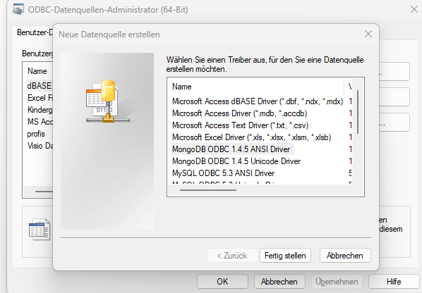

# MongoDB ODBC-Treiber einrichten 

Den Treiber für ODBC finden Sie unter:

https://github.com/mongodb/mongo-bi-connector-odbc-driver/releases/

Die Installation unter Windows ist einfach.  

Anschließend kann eine MongoDB-Datenquelle definiert werden:

mongodb://localhost:27017/  
